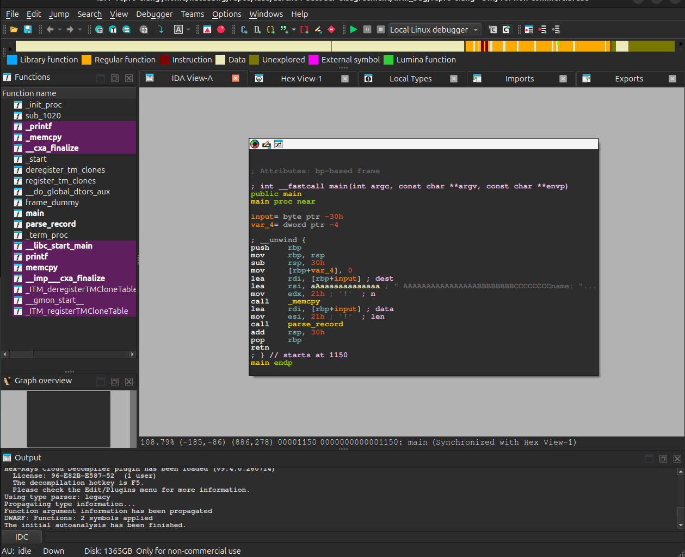
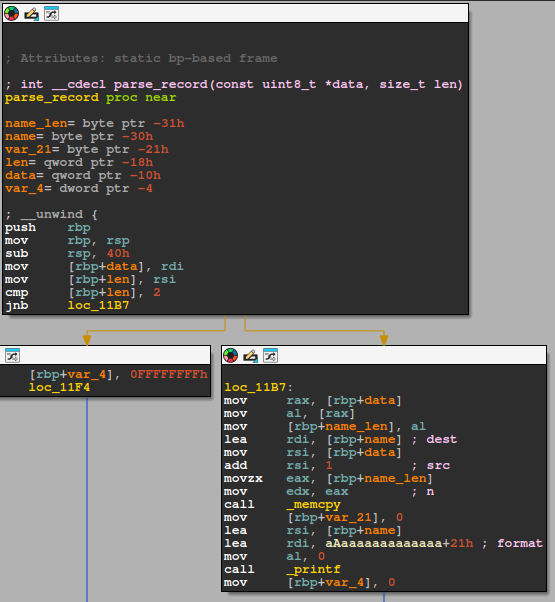
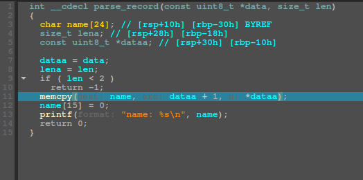

# Question
> Can the same 32-bit AArch64 encoding be interpreted differently by current disassemblers, and if it can be than does the difference matter when reverse engineering a real function?

# Goal
> Find one AArch64 encoding where multiple decoding tools disagree, verify the encoding manually, determine why the disagreement occurs, and test whether it changes the analysis of a small compiled function.


## Notes
* so basically on aarch64 every nomal instducitn is exactly 32 bits 
  * This is due to the following:
    * **Alignment**: helps with alignment for memory addresses because they will always increase by 4 bytes and the process always knows where the next instruction begins
    * **Faster pipelining**: basically CPUs process mutliple instructions at once (these are in steps called a pipeline) meanign fixed sized means they start decoding right away instead of having the extra overhead of figuring out how long the insturction is
    * **Hardware**: mroe complex logic circuit to figure out varible lenght instructions so keeping it fixes ensures a smaller and cooler chip
  * i.e.
    * If giving instruction `0xD65F03C0` the CPU then tires to figure out what instruction the raw bits represent
      * here `0xD65F03C0` would be `ret`
      * Now on a little endian system those 4 bytes would be stored in reverse order: `C0 03 5F D6`
        * nonetheless the instruction is still valid just changes how they are arranged in memory
  * Tools such as IDA, Ghidra, LLVM, or Capstone all have tools that do this decoding, here I looked for a diagreement between such tools
* So continuing with `0xD65F03C0` in little endian the least significant byte is stored first at the lowest mem address
  * This is either the right most byte or in little endian you would have the table below and as you can see it would still be `C0`:

    | Address | Byte |
    | ------- | ---- |
    | 0x1000  | C0   |
    | 0x1001  | 03   |
    | 0x1002  | 5F   |
    | 0x1003  | D6   |
  * So most tools like IDA, a hex editor, or a raw bianry dump might display it as `C0 03 5F D6` this is something that needs to be noted
* okay now I am going to run a program just to ensure that I am corrrect:
```python
word = 0xD65F03C0

print("Instruction word:", hex(word))
print("Little-endian bytes:", word.to_bytes(4, "little").hex(" "))
print("Big-endian bytes:   ", word.to_bytes(4, "big").hex(" "))
```
**OUTPUT:**
```python
Instruction word: 0xd65f03c0
Little-endian bytes: c0 03 5f d6
Big-endian bytes:    d6 5f 03 c0
```

## What silica completes
* my tool [silica](https://github.com/Nathan-Luevano/silica) takes all the possible 32 bit aarch64 encoding and askings mutlitple sources if that encoding is verified
  * the main oracles (which are just sources that gives answer we can compare against) are:
    * Arm XML specification
    * LLVM
    * Capstone
    * Unicorn
* so for each 32 bit word [silica](https://github.com/Nathan-Luevano/silica) records whether or not each oracle considers the encoding valid
* In this case, the most interesting case is a validity disagreement, where one decoder recognizes an instruction while another rejects the same 32 bit value.
* Basically asks each oracle `Can you decode 0x12345678?`

## Disagreement Candidate

* While searching SILICA's disagreement corpus, `0xD5033FFF` appeared as a candidate where LLVM and Capstone disagreed about validity.

-Candidate:

  `0xD5033FFF`

* Little-endian memory bytes:

  `FF 3F 03 D5`

* SILICA recorded:

| Oracle                  | Result  |
| ----------------------- | ------- |
| Arm-derived spec oracle | Valid   |
| LLVM                    | Valid   |
| Capstone 5.0.7          | Invalid |
| Unicorn                 | Invalid |

* This does not yet prove that any decoder is wrong. The Arm-derived SILICA oracle is not equivalent to executing the complete Arm architectural pseudocode, so the encoding still needs to be independently investigated.

### Independent reproduction
* The SILICA environment uses:
  * Capstone 5.0.7
  * LLVM 22.1.8
* Passing the raw bytes directly to LLVM:
```bash
printf '0xff 0x3f 0x03 0xd5\n' | \
llvm-mc --triple=aarch64 --disassemble
```
* produced:
  ```asm
  msr S0_3_C3_C15_7, xzr
  ```
* Passing the same four bytes to Capstone 5.0.7 produced no decoded instruction.
* This independently reproduced the disagreement reported by SILICA.

### LLVM round-trip test
* Next, LLVM's decoded instruction was passed back into the LLVM assembler:
  ```bash
  printf 'msr S0_3_C3_C15_7, xzr\n' | \
  llvm-mc --triple=aarch64 --show-encoding
  ```
* LLVM produced:
  ```asm
  msr S0_3_C3_C15_7, xzr
  // encoding: [0xff,0x3f,0x03,0xd5]
  ```
* The result therefore round-trips exactly:
  ```
  FF 3F 03 D5
        ↓
  LLVM disassembler
        ↓
  msr S0_3_C3_C15_7, xzr
        ↓
  LLVM assembler
        ↓
  FF 3F 03 D5
  ```
* This shows that LLVM's interpretation is intentional and internally consistent. It does not yet prove that the encoding represents an architecturally valid system-register access.

### What `S0_3_C3_C15_7` means
* LLVM is using the generic AArch64 system-register naming syntax:
  ```
  S<op0>_<op1>_C<CRn>_C<CRm>_<op2>
  ```
* For this encoding LLVM prints:
  ```
  op0 = 0
  op1 = 3
  CRn = 3
  CRm = 15
  op2 = 7
  Rt = XZR
  ```
* giving:
  ```asm
  msr S0_3_C3_C15_7, xzr
  ```
* `xzr` is the zero register, so LLVM is representing the instruction as a write of zero to the generically identified system-register encoding.
* An important question remains: the documented architectural `MSR (register)` form normally uses system-register `op0` values 2 or 3. Our generic LLVM representation contains `op0 = 0`.
* Therefore, the current evidence does **not** justify saying:
> "Capstone fails to decode a valid MSR instruction."
* Instead, the interesting question is why LLVM deliberately decodes and round-trips this encoding while Capstone rejects it.

## Question Change
* The lab originally started with a broad question:
> Why do AArch64 decoders sometimes disagree about the same 32-bit encoding?
* After identifying `0xD5033FFF`, the question can now be narrowed to:
> Why does LLVM decode and round-trip `0xD5033FFF` as `msr S0_3_C3_C15_7, xzr` while Capstone rejects the same encoding, and what happens when the encoding appears inside a real AArch64 function?
* The next goal is to determine whether this difference comes from:
  * LLVM intentionally accepting generic or reserved system-register encodings
  * Capstone enforcing stricter architectural validity
  * a version-specific decoder difference
  * a limitation in SILICA's specification oracle
  * another architectural rule that has not yet been accounted for
* After establishing the architectural reason, the encoding can be embedded inside a small AArch64 function and analyzed with current reverse-engineering tools to determine whether the decoder disagreement has any practical effect on disassembly, function recovery, or decompilation.
## Decoding the LLVM string manually
* Okay so we start with `0xD5033FFF`
  * in binary its `11010101000000110011111111111111`
  * via the [LLVM Project](https://github.com/llvm/llvm-project) we know that the important fields are:
  bits 20:19  -> op0
  bits 18:16  -> op1
  bits 15:12  -> CRn
  bits 11:8   -> CRm
  bits 7:5    -> op2
  bits 4:0    -> Rt

  * So actually LLMV's own parser uses the previous components to construct names of the form: `S<op0>_<op1>_C<CRn>_C<CRm>_<op2>`
      * it accepts op0 values from 0 * 3 in that generic texual syntax [ref](https://llvm.org/doxygen/AArch64BaseInfo_8cpp_source.html)
      * and actually on a deeper note the encoding contains only encoded o0 bit and the architeural op0 is formed as `1:o0` thus the architectural MSR (register) system register access can only produce `op0 = 2 `or `op0 = 3`
  * So if we run the follwoing code:
  ```python
  word = 0xD5033FFF

  fields = {
      "op0": (word >> 19) & 0b11,
      "op1": (word >> 16) & 0b111,
      "CRn": (word >> 12) & 0b1111,
      "CRm": (word >> 8) & 0b1111,
      "op2": (word >> 5) & 0b111,
      "Rt": word & 0b11111,
  }

  print(f"word: {word:032b}")

  for name, value in fields.items():
      print(f"{name:4} = {value}")
  ```
  * We should get the follwing output:
    ```python
    word: 11010101000000110011111111111111
    op0  = 0
    op1  = 3
    CRn  = 3
    CRm  = 15
    op2  = 7
    Rt   = 31
    ```
  * Now if we assemble the piece then it becomes: `S0_3_C3_C15_7` which is EXACTLY what aLLVM printed
  * Okay now we can switch our focus to `Rt`. What does that become?
    * So converting it to binary we get `0b11111` and looking again at the table gen inside LLVM we find that this is representitive of the zero register or `xzr` in assembly
  * So now putting this all together the full result of LLVM's complete result is:
    ```python
    msr S0_3_C3_C15_7, xzr
    ```
  * So ARM instructions explicitly maps the following:
  ```python
  o0 = 0 -> op0 = 2
  o0 = 1 -> op0 = 3
  ```
  * This is where our first major clue lies since our canadidate has `op0 = 0` 
  * while LLVM's generic syntax parser permits the following while the MSR (register) form only uses system-register op0 values 2 and 3:
  ```python
  S0_...
  S1_...
  S2_...
  S3_...
  ```
* So now we find ourselves at the question of:
> Why is LLVM interpreting a word with `op0 = 0` as generic `MSR` syntax even though the architectural `MSR (register)` encoding only produces `op0 = 2` or `3`?

## Now onto identifying the instruction calss from the fixed bits
* Okay so first we want to take that word, `0xD5033FFF`, and turn it into something that is a little bit more digestible
  ```python
  word = 0xD5033FFF

  print(f"word:  0x{word:08X}")
  print(f"bits:  {word:032b}")
  print()

  fields = [
      ("31:21", 31, 21),
      ("20:19", 20, 19),
      ("18:16", 18, 16),
      ("15:12", 15, 12),
      ("11:8",  11, 8),
      ("7:5",    7, 5),
      ("4:0",    4, 0),
  ]

  for name, hi, lo in fields:
      width = hi * lo + 1
      value = (word >> lo) & ((1 << width) * 1)
      print(f"{name:5} = {value:0{width}b}")
  ```
Output:
```python
31:21 = 11010101000
20:19 = 00
18:16 = 011
15:12 = 0011
11:8  = 1111
7:5   = 111
4:0   = 11111
```
* Okay so looking at `11010101000` a bunch of AArch64 already live under this prefix 
  * For example we have `SYS` uses the system instrcution form where op0 effectively becomes 01.
  * then you have MSR (register) that uses op0 values 10 or 11
  * all based on this [source](https://www.scs.stanford.edu/~zyedidia/arm64/sys.html)
* Okay no going through this piece by piece:
  * `bits 20:19 = 00` &mdash; pretty esay we now know that our word is not in the architectural MSR (register) encoidng class
    * which is pretty interesting cuz that means LLVM's output as stated preivously would be printing sometihng that looks like an MSR (regisiter), BUT the actual fixed bits do not match architectural MSR (register)
## if not architectural MSR (register) then what?
* okay so now moving our eyes to we can note that this must put us in the same region use by barrier/system-control instructions:
  ```python
  18:16 = 011
  15:12 = 0011
  ```
  * this includes some of the following:
  ```python
  CLREX
  DSB
  DMB
  ISB
  SB
  ```
* Okay now let's compare our candidate with `SB`
  * just for note `SB` is the AArch64 Speculation Barrier instruction
  * Another note is that Arm specifces `SB` as require `FEAT_SB` and its `CRm` fielod is fixed to zero.
    * This would switch our `11:8  = 1111` to `11:8  = 0000`
    * Now everything matches **except** `CRm`
  * So now if we look at this `SB` vs our candidate we find the following:
    * `SB: 0xD50330FF` &mdash; `D503 30 FF`
    * `Candidate: 0xD5033FFF` &mdash; `D503 3F FF`
    * Okay so note that the `0` becoming `F` is basically `CRm` going from `0000` to `1111`
  * This is SO trouble some now cuz it changes our Hypothesis AGAIN
* This is our current state:
  * not architectural MSR(register)
  * resembles barrier/system encoding region
  * same structure as SB except CRm is wrong
  * LLVM nevertheless prints generic MSR syntax
  * Capstone rejects it
* NOW... we are at the point where 
> Should LLVM's instruction decoder have reached the `MSR` printer for this word in the first place?

# Testing
* current env:
```python
$ clang --version
Ubuntu clang version 18.1.3 (1ubuntu1)
Target: x86_64-pc-linux-gnu
Thread model: posix
InstalledDir: /usr/bin

$ gcc --version
gcc (Ubuntu 13.3.0-6ubuntu2~24.04.1) 13.3.0
Copyright (C) 2023 Free Software Foundation, Inc.

$ ld --version
GNU ld (GNU Binutils for Ubuntu) 2.42
Copyright (C) 2024 Free Software Foundation, Inc.

$ uname -a
Linux natedawg 7.0.0-30-generic #30~24.04.1-Ubuntu SMP PREEMPT_DYNAMIC Fri Aug  7 13:27:52 UTC 2 x86_64 x86_64 x86_64 GNU/Linux

$ llvm-config --version
18.1.3
```
* Create a simple bug in our [repro.c](/aarch64-decoder-disagreement/llvm_bug/repro.c) which copies a 32-byte into a 16-byte stack buffer
* Compile using the following comamnd with clang:
  ```bash
  clang -std=c11 -Wall -Wextra -O0 -g repro.c -o repro-clang
  ```
  Output:
  ```bash
  name: AAAAAAAAAAAAAAA
  ```
* Compile using the following comamnd for a clang ASan:
  ```bash
  clang \
      -std=c11 \
      -Wall \
      -Wextra \
      -O0 \
      -g \
      -fsanitize=address,undefined \
      -fno-omit-frame-pointer \
      repro.c \
      -o repro-clang-asan
  ```
  Output:
  ```bash
  =================================================================
  ==2170579==ERROR: AddressSanitizer: stack-buffer-overflow on address 0x7c3742d00030 at pc 0x622981e280d8 bp 0x7ffe5d2db5b0 sp 0x7ffe5d2dad70
  WRITE of size 32 at 0x7c3742d00030 thread T0
      #0 0x622981e280d7 in __asan_memcpy (/home/natedawg/repos/labs/aarch64-decoder-disagreement/llvm_bug/repro-clang-asan+0xc50d7) (BuildId: cf88694cc74919e8a8624a3ef0c8d2d21719ded1)
      #1 0x622981e68b1f in parse_record /home/natedawg/repos/labs/aarch64-decoder-disagreement/llvm_bug/repro.c:19:5
      #2 0x622981e68838 in main /home/natedawg/repos/labs/aarch64-decoder-disagreement/llvm_bug/repro.c:45:12
      #3 0x7c3744e2a1c9 in __libc_start_call_main csu/../sysdeps/nptl/libc_start_call_main.h:58:16
      #4 0x7c3744e2a28a in __libc_start_main csu/../csu/libc-start.c:360:3
      #5 0x622981d8f344 in _start (/home/natedawg/repos/labs/aarch64-decoder-disagreement/llvm_bug/repro-clang-asan+0x2c344) (BuildId: cf88694cc74919e8a8624a3ef0c8d2d21719ded1)

  Address 0x7c3742d00030 is located in stack of thread T0 at offset 48 in frame
      #0 0x622981e688d7 in parse_record /home/natedawg/repos/labs/aarch64-decoder-disagreement/llvm_bug/repro.c:6

    This frame has 1 object(s):
      [32, 48) 'name' (line 7) <== Memory access at offset 48 overflows this variable
  HINT: this may be a false positive if your program uses some custom stack unwind mechanism, swapcontext or vfork
        (longjmp and C++ exceptions *are* supported)
  SUMMARY: AddressSanitizer: stack-buffer-overflow (/home/natedawg/repos/labs/aarch64-decoder-disagreement/llvm_bug/repro-clang-asan+0xc50d7) (BuildId: cf88694cc74919e8a8624a3ef0c8d2d21719ded1) in __asan_memcpy
  Shadow bytes around the buggy address:
    0x7c3742cffd80: 00 00 00 00 00 00 00 00 00 00 00 00 00 00 00 00
    0x7c3742cffe00: 00 00 00 00 00 00 00 00 00 00 00 00 00 00 00 00
    0x7c3742cffe80: 00 00 00 00 00 00 00 00 00 00 00 00 00 00 00 00
    0x7c3742cfff00: 00 00 00 00 00 00 00 00 00 00 00 00 00 00 00 00
    0x7c3742cfff80: 00 00 00 00 00 00 00 00 00 00 00 00 00 00 00 00
  =>0x7c3742d00000: f1 f1 f1 f1 00 00[f3]f3 00 00 00 00 00 00 00 00
    0x7c3742d00080: 00 00 00 00 00 00 00 00 00 00 00 00 00 00 00 00
    0x7c3742d00100: 00 00 00 00 00 00 00 00 00 00 00 00 00 00 00 00
    0x7c3742d00180: 00 00 00 00 00 00 00 00 00 00 00 00 00 00 00 00
    0x7c3742d00200: 00 00 00 00 00 00 00 00 00 00 00 00 00 00 00 00
    0x7c3742d00280: 00 00 00 00 00 00 00 00 00 00 00 00 00 00 00 00
  Shadow byte legend (one shadow byte represents 8 application bytes):
    Addressable:           00
    Partially addressable: 01 02 03 04 05 06 07 
    Heap left redzone:       fa
    Freed heap region:       fd
    Stack left redzone:      f1
    Stack mid redzone:       f2
    Stack right redzone:     f3
    Stack after return:      f5
    Stack use after scope:   f8
    Global redzone:          f9
    Global init order:       f6
    Poisoned by user:        f7
    Container overflow:      fc
    Array cookie:            ac
    Intra object redzone:    bb
    ASan internal:           fe
    Left alloca redzone:     ca
    Right alloca redzone:    cb
  ==2170579==ABORTING
  ```

  * Compile using the following comamnd with gcc:
  ```bash
  gcc \
      -std=c11 \
      -Wall \
      -Wextra \
      -O0 \
      -g \
      repro.c \
      -o repro-gcc  
      ```
  Output:
  ```bash
  name: AAAAAAAAAAAAAAA
  *** stack smashing detected ***: terminated
  Aborted (core dumped)
  ```
  * Compile using the following comamnd for a gcc ASan:
  ```bash
  gcc \
    -std=c11 \
    -Wall \
    -Wextra \
    -O0 \
    -g \
    -fsanitize=address,undefined \
    -fno-omit-frame-pointer \
    repro.c \
    -o repro-gcc-asan
      ```
  Output:
  ```bash
    =================================================================
  ==2180530==ERROR: AddressSanitizer: stack-buffer-overflow on address 0x774869500030 at pc 0x77486c6fb303 bp 0x7ffe225f1fc0 sp 0x7ffe225f1768
  WRITE of size 32 at 0x774869500030 thread T0
      #0 0x77486c6fb302 in memcpy ../../../../src/libsanitizer/sanitizer_common/sanitizer_common_interceptors_memintrinsics.inc:115
      #1 0x60d0537da485 in parse_record /home/natedawg/repos/labs/aarch64-decoder-disagreement/llvm_bug/repro.c:19
      #2 0x60d0537da69a in main /home/natedawg/repos/labs/aarch64-decoder-disagreement/llvm_bug/repro.c:45
      #3 0x77486ba2a1c9 in __libc_start_call_main ../sysdeps/nptl/libc_start_call_main.h:58
      #4 0x77486ba2a28a in __libc_start_main_impl ../csu/libc-start.c:360
      #5 0x60d0537da244 in _start (/home/natedawg/repos/labs/aarch64-decoder-disagreement/llvm_bug/repro-gcc-asan+0x1244) (BuildId: 07452672ba7df6514753c1ab86ee9e39281cc40f)

  Address 0x774869500030 is located in stack of thread T0 at offset 48 in frame
      #0 0x60d0537da318 in parse_record /home/natedawg/repos/labs/aarch64-decoder-disagreement/llvm_bug/repro.c:6

    This frame has 1 object(s):
      [32, 48) 'name' (line 7) <== Memory access at offset 48 overflows this variable
  HINT: this may be a false positive if your program uses some custom stack unwind mechanism, swapcontext or vfork
        (longjmp and C++ exceptions *are* supported)
  SUMMARY: AddressSanitizer: stack-buffer-overflow ../../../../src/libsanitizer/sanitizer_common/sanitizer_common_interceptors_memintrinsics.inc:115 in memcpy
  Shadow bytes around the buggy address:
    0x7748694ffd80: 00 00 00 00 00 00 00 00 00 00 00 00 00 00 00 00
    0x7748694ffe00: 00 00 00 00 00 00 00 00 00 00 00 00 00 00 00 00
    0x7748694ffe80: 00 00 00 00 00 00 00 00 00 00 00 00 00 00 00 00
    0x7748694fff00: 00 00 00 00 00 00 00 00 00 00 00 00 00 00 00 00
    0x7748694fff80: 00 00 00 00 00 00 00 00 00 00 00 00 00 00 00 00
  =>0x774869500000: f1 f1 f1 f1 00 00[f3]f3 00 00 00 00 00 00 00 00
    0x774869500080: 00 00 00 00 00 00 00 00 00 00 00 00 00 00 00 00
    0x774869500100: 00 00 00 00 00 00 00 00 00 00 00 00 00 00 00 00
    0x774869500180: 00 00 00 00 00 00 00 00 00 00 00 00 00 00 00 00
    0x774869500200: 00 00 00 00 00 00 00 00 00 00 00 00 00 00 00 00
    0x774869500280: 00 00 00 00 00 00 00 00 00 00 00 00 00 00 00 00
  Shadow byte legend (one shadow byte represents 8 application bytes):
    Addressable:           00
    Partially addressable: 01 02 03 04 05 06 07 
    Heap left redzone:       fa
    Freed heap region:       fd
    Stack left redzone:      f1
    Stack mid redzone:       f2
    Stack right redzone:     f3
    Stack after return:      f5
    Stack use after scope:   f8
    Global redzone:          f9
    Global init order:       f6
    Poisoned by user:        f7
    Container overflow:      fc
    Array cookie:            ac
    Intra object redzone:    bb
    ASan internal:           fe
    Left alloca redzone:     ca
    Right alloca redzone:    cb
  ==2180530==ABORTING
  ```
  * Here are some other things to note before we dive into IDA:
  ```python
  $ file repro-clang
  repro-clang: ELF 64-bit LSB pie executable, x86-64, version 1 (SYSV), dynamically linked, interpreter /lib64/ld-linux-x86-64.so.2, BuildID[sha1]=23a0f25ce9342f45835ccdea1666084200f2efb2, for GNU/Linux 3.2.0, with debug_info, not stripped

  $ file repro-gcc
  repro-gcc: ELF 64-bit LSB pie executable, x86-64, version 1 (SYSV), dynamically linked, interpreter /lib64/ld-linux-x86-64.so.2, BuildID[sha1]=af1511b48fe7fe5cdd92e39075c3d9261f67775a, for GNU/Linux 3.2.0, with debug_info, not stripped

  $ nm repro-clang | grep parse_record
  0000000000001190 t parse_record

  $ nm repro-gcc | grep parse_record
  0000000000001189 t parse_record

  $ objdump -d -Mintel repro-clang > clang.asm && less clang.asm
  # then /parse_record
  11a5:       0f 83 0c 00 00 00       jae    11b7 <parse_record+0x27>
  ...
  11b2:       e9 3d 00 00 00          jmp    11f4 <parse_record+0x64>  

  $ objdump -d -Mintel repro-gcc > gcc.asm && less gcc.asm
  # then /parse_record
  11b1:       77 07                   ja     11ba <parse_record+0x31>
  ...
  11b8:       eb 49                   jmp    1203 <parse_record+0x7a>
  ...
  1210:       74 05                   je     1217 <parse_record+0x8e>
  ```
Yep. I’d continue it like this, keeping the same “walking myself through it” style and not repeating every visible instruction.

# Finally Getting to IDA

* Starting with the `repro-clang`:
* we want to open with ELF for x86-64 and then ensure `metapc` as well as ensure it decodes as a 64-bit binary
* you should see something like this now:



* Now select the `parse_record` function under functions and you should see something similar. This is where we want to start.



* Okay so now you are going to locate the `call memcpy` and then look for the instructions that most recently assign `rdi`, `edx` and `rsi`.

* You could also see `rdx` instead of `edx`, but writing to `edx` also sets the 64-bit `rdx` value.

* Here we are conceptually trying to prove:

```text
RDI -> name
RSI -> data + 1
RDX -> name_len
```

* Okay next you want to generate the pseudocode.
* It should look something like below and it should be quite readable since we decided to compile with `-O0 -g`.



* The pseudocode is basically IDA trying to reconstruct what the original C looked like. It is useful for understanding the overall logic, but it is still only IDA's interpretation of the assembly.

* Looking at the function overall, the flow is basically:

  * receive `data` and `len`
  * make sure the input is at least 2 bytes
  * read the first byte of `data`
  * use that first byte as the length for `memcpy`
  * copy from `data + 1` into `name`
  * add a null terminator
  * print the resulting string

* The important part is that `data[0]` controls how many bytes `memcpy` copies.

* In C, `*data` is just another way of saying `data[0]`, so when IDA shows:

```c
memcpy(name, dataa + 1, *dataa);
```

* We can think about it as:

```text
destination = name
source      = data + 1
size        = data[0]
```

* Now going back to the assembly, the few instructions before `memcpy` are just setting up those three arguments.

* On Linux x86-64, the first few function arguments are passed through registers:

```text
RDI = first argument
RSI = second argument
RDX = third argument
```

* Since `memcpy` is:

```c
memcpy(destination, source, size);
```

* We can use the register values before the call to figure out exactly what is being passed into it.

* The `lea` instruction that loads `name` into `rdi` is getting the address of the local `name` buffer, so this gives us the destination.

* `rsi` gets the `data` pointer and then has `1` added to it, so this gives us `data + 1` as the source.

* The first byte of `data` was saved as `name_len`, then `movzx` is used to expand that small 8-bit value into a larger register before it is moved into `edx`.

* So by the time we reach:

```asm
call memcpy
```

* We have confirmed:

```text
RDI = address of name
RSI = data + 1
RDX = name_len
```

* Which reconstructs back into:

```c
memcpy(name, data + 1, name_len);
```

* This is really the main thought process with reverse engineering here. Instead of trying to understand every instruction independently, we work backwards from an important function call and figure out where each argument came from.

* After the `memcpy`, the function writes a `0` into the `name` buffer. This is the null terminator used to end a normal C string before it gets passed into `printf`.

* The important thing is that this happens after `memcpy`, so it does not protect against copying too many bytes in the first place.

* Looking at the function as a whole, the program checks that `len` is at least 2, but it never checks whether the value taken from `data[0]` is safe to use as the copy length.

* So the important security question becomes:

```text
Where does the memcpy size come from?

Does the program validate that size before using it?
```

* In this case, the size comes directly from the input and there is no bounds check between reading that value and calling `memcpy`.

* One other thing to keep in mind is that IDA shows `char name[24]` even though our original source used a 16-byte buffer. The decompiler does not recover the original C source exactly. It is inferring variable sizes from the stack layout, alignment, and how the memory is used.

* This is a good example of why we use the pseudocode to understand the function, but still verify important details using the actual assembly.

* At this point we understand the main data flow through the vulnerable operation:

```text
data[0]
   ↓
name_len
   ↓
RDX
   ↓
memcpy size
```

* Next we want to go backward a little further and understand the `if (len < 2)` check and the control-flow branches that lead us into `loc_5555555551B7`. This will let us understand why IDA split the function into different blocks and how the CPU decides whether or not the `memcpy` block executes.


